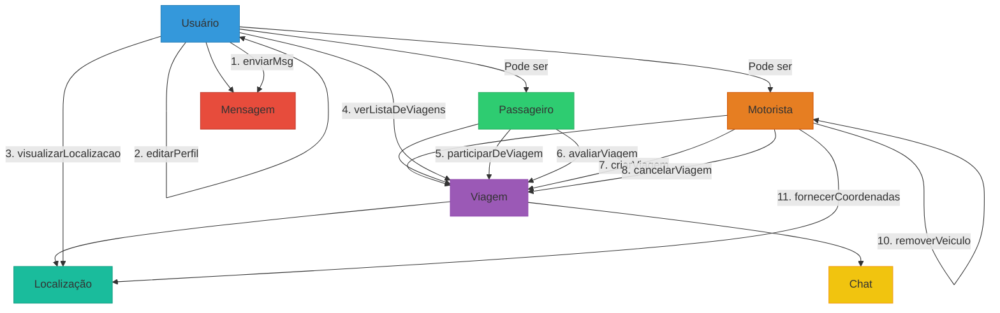
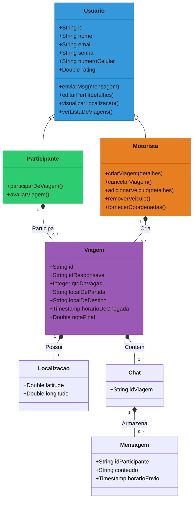

> # Diagrama de Classes do Unicar ride

```mermaid
flowchart TD
    %% Entidades Principais
    U[Usuário] -->|Pode ser| P[Passageiro]
    U -->|Pode ser| M[Motorista]
    U --> MSG[Mensagem]
    M --> V[Viagem]
    P --> V
    V --> LOC[Localização]
    V --> CHAT[Chat]


    %% Relações de Funcionalidades
    U -->|1. enviarMsg| MSG
    U -->|2. editarPerfil| U
    U -->|3. visualizarLocalizacao| LOC
    U -->|4. verListaDeViagens| V


    P -->|5. participarDeViagem| V
    P -->|6. avaliarViagem| V


    M -->|7. criarViagem| V
    M -->|8. cancelarViagem| V
    M -->|9. adicionarVeiculo| M
    M -->|10. removerVeiculo| M
    M -->|11. fornecerCoordenadas| LOC


    %% Estilos (sem legend para compatibilidade)
    style U fill:#3498db,stroke:#2980b9
    style P fill:#2ecc71,stroke:#27ae60
    style M fill:#e67e22,stroke:#d35400
    style V fill:#9b59b6,stroke:#8e44ad
    style LOC fill:#1abc9c,stroke:#16a085
    style CHAT fill:#f1c40f,stroke:#f39c12
    style MSG fill:#e74c3c,stroke:#c0392b
```

```mermaid
classDiagram
    %% Entidades do Sistema
    class Usuario {
        +String id
        +String nome
        +String email
        +String senha
        +String numeroCelular
        +Double rating
        
        +enviarMsg(mensagem)
        +editarPerfil(detalhes)
        +visualizarLocalizacao()
        +verListaDeViagens()
    }

    class Participante {
        +participarDeViagem()
        +avaliarViagem()
    }

    class Motorista {
        +criarViagem(detalhes)
        +cancelarViagem()
        +adicionarVeiculo(detalhes)
        +removerVeiculo()
        +fornecerCoordenadas()
    }

    class Viagem {
        +String id
        +String idResponsavel
        +Integer qtdDeVagas
        +String localDePartida
        +String localDeDestino
        +Timestamp horarioDeChegada
        +Double notaFinal
    }

    class Localizacao {
        +Double latitude
        +Double longitude
    }

    class Chat {
        +String idViagem
    }

    class Mensagem {
        +String idParticipante
        +String conteudo
        +Timestamp horarioEnvio
    }

    %% Relacionamentos
    Usuario <|-- Participante
    Usuario <|-- Motorista
    Participante "1" *-- "0..*" Viagem: Participa
    Motorista "1" *-- "0..*" Viagem: Cria
    Viagem "1" *-- "1" Localizacao: Possui
    Viagem "1" *-- "1" Chat: Contém
    Chat "1" *-- "0..*" Mensagem: Armazena

    %% Estilos (opcional)
    style Usuario fill:#3498db,stroke:#2980b9
    style Participante fill:#2ecc71,stroke:#27ae60
    style Motorista fill:#e67e22,stroke:#d35400
    style Viagem fill:#9b59b6,stroke:#8e44ad
```
