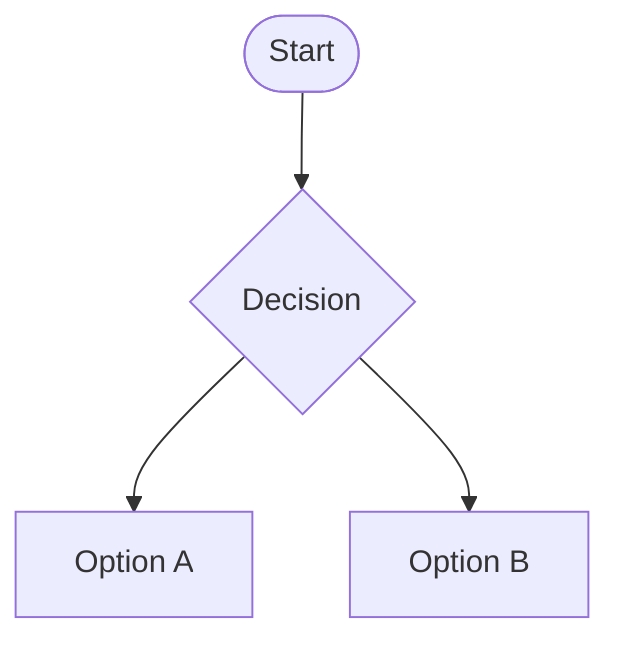

# Caso de Uso: [ID]

## Nome

[Nome do caso de uso]

## Descrição

[Descrição breve do caso de uso]

## Atores

- [Ator primário]
- [Atores secundários, se houver]

## Pré-condições

1. [Pré-condição 1]
2. [Pré-condição 2]
3. [Pré-condição n]

## Fluxo Básico

1. [Passo 1]
2. [Passo 2]
3. [Passo n]

## Fluxos Alternativos

### [Alternativa 1]

1. [Passo 1]
2. [Passo 2]
3. [Passo n]

### [Alternativa 2]

1. [Passo 1]
2. [Passo 2]
3. [Passo n]

## Fluxos de Exceção

### [Exceção 1]

1. [Passo 1]
2. [Passo 2]
3. [Passo n]

### [Exceção 2]

1. [Passo 1]
2. [Passo 2]
3. [Passo n]

## Pós-condições

1. [Pós-condição 1]
2. [Pós-condição 2]
3. [Pós-condição n]

## Requisitos Relacionados

- [Requisito 1]
- [Requisito 2]
- [Requisito n]

## Interface de Usuário

[Descrição ou referência a protótipos/mockups]

## Diagrama

