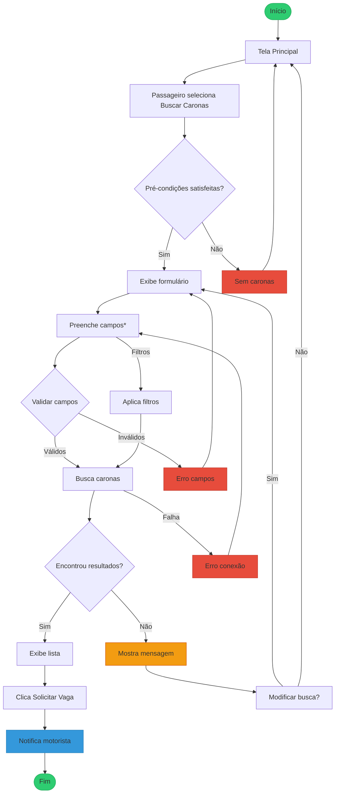
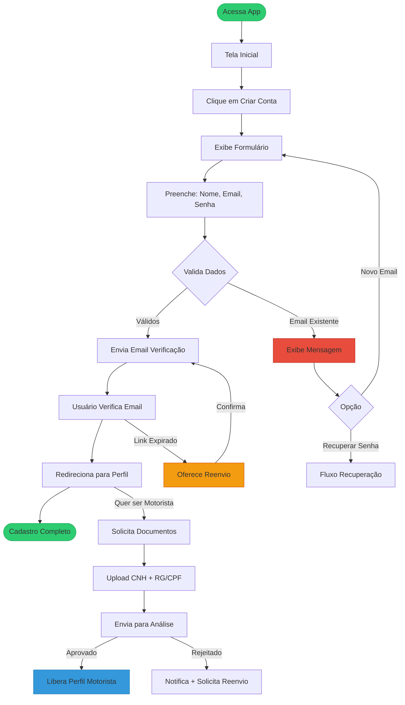
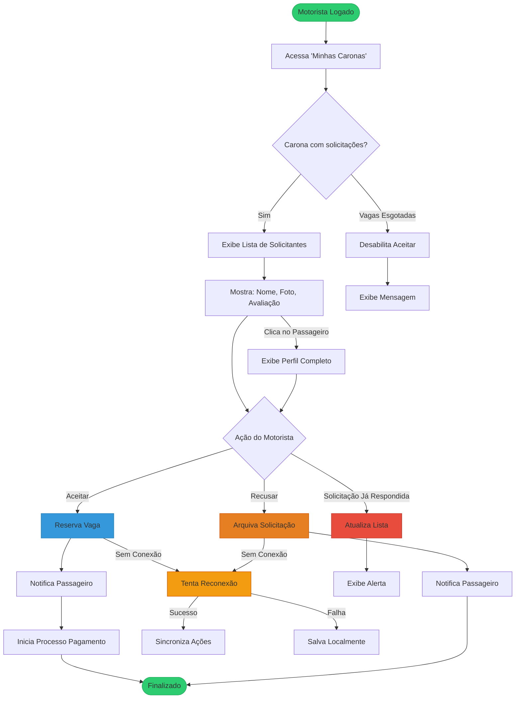

# Caso de Uso: UC001 

## Nome

Buscar Caronas Disponíveis

## Descrição

Este caso de uso permite que um passageiro busque caronas disponíveis com base em local de partida e destino, visualizando informações como nome do motorista, horário e vagas disponíveis.

## Atores

-Ator Primário: Passageiro
-Atores Secundários: Motorista (fornece as caronas disponíveis)

## Pré-condições

1. O usuário está autenticado no sistema.
2. Existem caronas cadastradas no sistema.

## Fluxo Básico

1. O passageiro acessa a tela principal e seleciona "Buscar Caronas".
* O sistema exibe um formulário com os campos:
  Local de Partida (obrigatório)

  Destino (obrigatório)

2. O passageiro preenche os campos e clica em "Buscar".
* O sistema retorna uma lista de caronas disponíveis, contendo:

  Nome do motorista
  
  Horário da carona
  
  Vagas disponíveis

3. O passageiro seleciona uma carona e clica em "Solicitar Vaga".
4. O sistema registra a solicitação e notifica o motorista.


## Fluxos Alternativos

### Alternativa 1
1. Filtros Adicionais
   
 1. No passo 2, o passageiro pode aplicar filtros adicionais (ex.: data, horário).

 2. O sistema atualiza a lista de caronas conforme os filtros selecionados.

### Alternativa 2

2. Nenhuma Carona Encontrada
   
 1. No passo 4, se não houver caronas disponíveis, o sistema exibe:

 2. "Nenhuma carona encontrada para o trajeto selecionado."

 3. O passageiro pode ajustar os critérios de busca e tentar novamente.
   
## Fluxos de Exceção

### Exceção 1

1. Campos Obrigatórios Não Preenchidos
No passo 3, se o passageiro não preencher os campos obrigatórios, o sistema exibe:

 "Preencha o local de partida e destino para buscar caronas."

O sistema impede a busca até que os campos sejam preenchidos.

### Exceção 2

2. Falha na Conexão
No passo 4, se houver falha na conexão, o sistema exibe:

 "Não foi possível buscar caronas. Verifique sua conexão e tente novamente."

## Pós-condições

1. O passageiro visualiza a lista de caronas disponíveis.
2. Se uma solicitação for enviada, o motorista é notificado.


## Requisitos Relacionados

- RF001: Buscar caronas por local de partida e destino.
- RF008: Motorista pode criar ofertas de carona.
- RNF002: Segurança na autenticação do usuário.

## Interface de Usuário

#### Tela de Busca:
Campos de texto para Local de Partida e Destino.

Botão "Buscar".

#### Lista de resultados com:
Foto e nome do motorista.

## Diagrama


# Caso de Uso: UC002 

## Nome

 Realizar Pagamento da Carona

## Descrição

Permite que o passageiro realize o pagamento de uma carona solicitada e aceita, utilizando PIX ou cartão de crédito/débito, gerando um comprovante digital.

## Atores

- Ator Primário: Passageiro
- Atores Secundários:
 Motorista (recebe confirmação do pagamento)
 Sistema de Pagamento (processa a transação)

## Pré-condições

1. O passageiro está autenticado no sistema.
2. O motorista aceitou a solicitação de carona.
3. O passageiro ainda não realizou o pagamento.

## Fluxo Básico

1. O sistema exibe a opção "Pagar Carona" na tela de caronas confirmadas.
2. O passageiro seleciona o método de pagamento (PIX ou Cartão).
- Para PIX:

   O sistema gera um QR Code ou código copia-e-cola.

   O passageiro realiza o pagamento via app bancário.

- Para Cartão:

  O sistema redireciona para tela de inserção de dados do cartão.

  O passageiro preenche os dados e confirma o pagamento.

3. O sistema processa o pagamento e:

  Envia confirmação ao motorista.

  Gera e envia recibo digital por e-mail ao passageiro.

  A vaga na carona é oficialmente reservada.


## Fluxos Alternativos

### Alternativa 1

1. Pagamento com Cartão Salvo
   
 - No passo 2, se o passageiro tiver cartão cadastrado:

    O sistema mostra opção "Usar Cartão Salvo".

    O pagamento é processado automaticamente após confirmação.

### Alternativa 2
1. Pagamento Pendente (PIX não concluído)
 - Se o passageiro não finalizar o PIX em 30 minutos:
2. O sistema cancela a reserva automaticamente.
3. Notifica o passageiro: "Pagamento não concluído. Tente novamente."


## Fluxos de Exceção

### Exceção 1: Pagamento Recusado

1. Se o pagamento for recusado (cartão negado/PIX falho):
2. O sistema exibe: "Pagamento não aprovado. Tente outro método."
3. Permite nova tentativa ou alteração de método.

### Exceção 2: Falha no Processamento

1. Se houver erro no sistema durante o pagamento:
2. O sistema registra a falha e exibe: "Erro ao processar. Tente mais tarde."
3. A carona permanece como "pendente de pagamento".

## Pós-condições

1. O motorista recebe confirmação da reserva paga.
2. O passageiro recebe recibo por e-mail.
3. A vaga é marcada como ocupada na carona.

## Requisitos Relacionados

- RF002: Pagamento via PIX ou cartão.
- RNF002: Segurança nas transações (dados criptografados).
- RF005: Motorista só confirma após pagamento.

## Interface de Usuário

#### Tela de Pagamento:

- Seletor de método (PIX/Cartão).
- QR Code ou campo para dados do cartão.
- Botão "Confirmar Pagamento".
- Mensagem de status (ex.: "Aguardando confirmação PIX").

#### E-mail de Recibo:

- Detalhes da carona (motorista, horário, valor).
- Código da transação.
- Horário e vagas disponíveis.
- Botão "Solicitar Vaga".

## Diagrama


# Caso de Uso: UC003

## Nome

Gerenciar Perfil do Usuário

## Descrição

Permite que o usuário (passageiro ou motorista) visualize, edite e mantenha seu perfil atualizado com informações pessoais, foto e histórico de caronas, garantindo transparência e confiabilidade no sistema.

## Atores
 
- Ator Primário: Usuário (Passageiro ou Motorista)
- Atores Secundários:

   Outros usuários (visualizam o perfil)

   Sistema de Avaliações (atualiza as médias)

## Pré-condições

1. O usuário está autenticado no sistema.
2. O perfil do usuário foi criado durante o cadastro.

## Fluxo Básico

1. O usuário acessa a seção "Meu Perfil" no menu principal.
- O sistema exibe as seguintes informações:

  - Nome completo
  - Foto (se cadastrada)
  - Curso/faculdade (opcional)
  - Média de avaliações (1-5 estrelas)
  - Histórico de caronas (como passageiro/motorista)

- Para editar:

  - O usuário clica em "Editar Perfil".

2. sistema permite modificar:

   - Foto (upload ou remoção)
   - Curso/faculdade

3. Outras informações pessoais (exceto avaliações)
4. O usuário confirma as alterações clicando em "Salvar".
5. O sistema atualiza o perfil e exibe mensagem: "Alterações salvas com sucesso!".

## Fluxos Alternativos

### Alternativa 1: Visualizar Perfil de Outro Usuário

1. O usuário clica no nome/perfil de outro participante (em uma carona ou chat).
- O sistema exibe:

 - Informações públicas (nome, foto, avaliações médias).
 - Botão "Enviar Mensagem" (se aplicável).
 - Não é possível editar o perfil de outros usuários.

### Alternativa 2: Usuário Não Possui Foto

1. Se o usuário não tiver foto cadastrada:

   - O sistema exibe um ícone padrão (silhueta).
   - Mostra a opção "Adicionar Foto" destacada.

## Fluxos de Exceção

### Exceção 1: Falha ao Salvar Alterações

1. Se houver erro de conexão ao salvar:

   - O sistema exibe: "Não foi possível atualizar. Verifique sua conexão."

- Mantém os dados anteriores.

###Exceção 2: Tentativa de Editar Avaliações

1. Se o usuário tentar modificar avaliações recebidas (via inspeção HTML/console):
    - O sistema bloqueia a ação e exibe: "Avaliações não podem ser alteradas."

## Pós-condições

1. As informações editadas são atualizadas no perfil.
2. Outros usuários visualizam as mudanças em interações futuras.
3. A média de avaliações permanece imutável pelo usuário.

## Requisitos Relacionados

- RF003: Perfil com nome, foto, curso e avaliações.
- RF006: Avaliações após caronas concluídas.
- RNF001: Autenticação segura para acesso ao perfil.
  
## Interface de Usuário

- Tela de Perfil Pessoal:

   - Foto (ou ícone) + botão "Alterar Foto".
   - Campos editáveis (nome, curso, etc.).
   - Seção de avaliações (somente leitura).
   - Botão "Salvar"/"Cancelar".

- Tela de Perfil de Terceiros:

   - Apenas visualização (sem opções de edição).
   - Botão "Enviar Mensagem" (se não bloqueado).

## Diagrama


# Caso de Uso: UC004 

## Nome

Cadastro e Verificação de Identidade

## Descrição

Permite que novos usuários (passageiros e motoristas) criem uma conta no sistema através de cadastro com e-mail e complete a verificação de identidade necessária para utilizar a plataforma.

## Atores

- Ator Primário: Novo Usuário
- Ator Secundário: Sistema de Autenticação

## Pré-condições

1. O usuário não possui conta cadastrada no sistema
2. O dispositivo possui conexão com internet

## Fluxo Básico


1. O usuário acessa a opção "Criar Conta" na tela inicial
2. O sistema exibe formulário de cadastro solicitando:

    - Nome completo
    - E-mail válido
    - Senha (mínimo 8 caracteres)
    - Confirmação de senha

3. O usuário preenche todos os campos obrigatórios
4. O sistema valida os dados e envia e-mail de verificação
5. O usuário acessa seu e-mail e clica no link de verificação
6. O sistema confirma a verificação e redireciona para completar perfil

## Fluxos Alternativos

### Alternativa 1: Cadastro como Motorista

1. No passo 6, o usuário seleciona "Quero ser Motorista"
2. O sistema solicita documentos adicionais (CNH e documento com foto)
3. O usuário faz upload dos documentos
4. O sistema envia para verificação manual
5. Após aprovação (em até 48h), perfil de motorista é liberado

## Fluxos de Exceção

### Exceção 1: E-mail já cadastrado

1. No passo 4, se e-mail já existir no sistema:
2. Exibe mensagem: "Este e-mail já está em uso. Recuperar senha?"
3. Oferece opções: "Tentar outro e-mail" ou "Recuperar acesso"

### Exceção 2: Link de verificação expirado

1. Se usuário tentar verificar após 24h:
2. Sistema exibe: "Link expirado. Reenviar verificação?"
3. Ao confirmar, enga novo e-mail de verificação

## Pós-condições

1. Nova conta é criada no sistema (status "não verificado")
2. Após verificação, conta muda para status "ativo"
3. Usuário pode acessar todas funcionalidades básicas

## Requisitos Relacionados

- RF004: Cadastro com e-mail e verificação
- RNF002: Segurança na autenticação
- RF008: Diferenciação passageiro/motorista

## Interface de Usuário

##### Tela de Cadastro:
Campos: Nome, E-mail, Senha (com indicador de força)
- Checkbox "Concordo com Termos de Uso"
- Botão "Criar Conta"

E-mail de Verificação:
- Assunto: "Confirme seu e-mail para [NomeApp]"
- Corpo com botão "Verificar Agora" (link válido por 24h)

Tela de Documentos (Motorista):
- Área de upload para CNH e RG/CPF
- Preview dos documentos enviados
- Status "Em Análise" após envio

Regras de Negócio:
- Senha deve conter: 8+ caracteres, 1 número e 1 caractere especial
- Contas não verificadas em 7 dias são excluídas automaticamente
- Motoristas precisam ter CNH válida e documento com foto legível

## Diagrama




# Caso de Uso:UC005


## Nome

 Aceitar ou Recusar Solicitações de Carona

## Descrição

Permite que motoristas visualizem e respondam às solicitações de passageiros para suas caronas oferecidas, podendo aceitar ou recusar cada pedido individualmente.

## Atores

- Ator Primário: Motorista
- Atores Secundários: Passageiro (solicitante) e Sistema de Notificações

## Pré-condições

1. O usuário está autenticado como motorista
2. Existe pelo menos uma carona criada pelo motorista
3. Há solicitações pendentes para essa carona

## Fluxo Básico

1. O motorista acessa a seção "Minhas Caronas"
2. Seleciona a carona específica com solicitações pendentes
3. O sistema exibe a lista de solicitantes com:
  - Nome e foto do passageiro
  - Curso/faculdade (se disponível)
  - Avaliação média (estrelas)
4. Para cada solicitação, o motorista pode:
  - Clicar em "Aceitar" para confirmar a vaga
  - Clicar em "Recusar" para negar a solicitação
  - O sistema atualiza o status e notifica o passageiro

## Fluxos Alternativos

### Alternativa 1: Visualizar Perfil Completo do Passageiro

1. No passo 3, o motorista clica no nome do passageiro
2. O sistema exibe perfil completo com:
- Histórico de caronas anteriores
- Comentários de avaliações
- Informações de contato (se permitido)

### Alternativa 2: Vagas Esgotadas

1. Se todas as vagas já estiverem preenchidas:
- O sistema desabilita novos "Aceitar"
- Exibe: "Todas as vagas já foram preenchidas"

## Fluxos de Exceção

### Exceção 1: Solicitação Já Respondida

1. Se outro dispositivo já tiver respondido:
- Exibe: "Esta solicitação já foi processada"
- Atualiza a lista em tempo real

### Exceção 2: Conexão Perdida

1. Se a conexão falhar durante o processo:
2. Mantém ações locais e sincroniza quando reconectar
3. Exibe: "Conectando... suas ações serão salvas"

## Pós-condições

 ##### 1. Para aceites:
- Passageiro recebe confirmação
- Vaga é reservada oficialmente
- Sistema inicia processo de pagamento
##### 2. Para recusas:
- Passageiro recebe notificação
- Solicitação é arquivada

## Requisitos Relacionados

- RF005: Motorista gerencia solicitações
- RF001: Passageiro busca caronas
- RF002: Pagamento após aceite

## Interface de Usuário

##### Tela de Solicitações: Lista com cards de cada passageiro
- Botões "Aceitar" (verde) e "Recusar" (vermelho)
- Contador "Vagas: 2/4"
- Notificação para Passageiro: Push notification: "Sua solicitação foi (aceita/recusada) por (Motorista)"
- Regras de Negócio: Motorista tem 24h para responder antes da solicitação expirar
- Passageiros recusados podem solicitar outras caronas
- Aceite gera obrigação de pagamento pelo passageiro

## Diagrama



# Caso de Uso: UC006 

## Nome

Avaliar Outro Usuário após Carona

## Descrição

Permite que usuários (passageiros e motoristas) avaliem uns aos outros após a conclusão de uma carona, atribuindo notas de 1 a 5 estrelas e comentários opcionais, contribuindo para a reputação no sistema.

## Atores

- Ator Primário: Usuário (Passageiro ou Motorista)
- Ator Secundário: Sistema de Reputação

## Pré-condições

1. A carona foi concluída (status "Finalizada")
2. O usuário ainda não avaliou o outro participante
3. O usuário está autenticado no sistema

## Fluxo Básico

1. Após 1 hora da finalização da carona, o sistema envia notificação:
- "Avalie sua experiência com [(Nome do Participante)"
2. O usuário acessa a seção "Histórico de Caronas"
3. Seleciona a carona concluída e clica em "Avaliar"
4. O sistema exibe formulário com:
- Seletor de 1-5 estrelas (obrigatório)
5. Campo de texto para comentário (opcional, até 200 caracteres)
6. O usuário preenche a avaliação e clica em "Enviar"
7. O sistema:
- Atualiza a média do participante avaliado
- Armazena a avaliação no histórico
- Notifica o avaliado sobre a nova avaliação

## Fluxos Alternativos

### Alternativa 1: Avaliação Anônima

1. Para avaliações negativas (≤ 2 estrelas):
- O sistema oferece opção "Enviar anonimamente"
2. Comentários não identificam o avaliador

### Alternativa 2: Edição de Avaliação

1. Se o usuário enviar por engano:
- Permite editar dentro de 2 horas após envio
2. Após este período, avaliação torna-se permanente
  
## Fluxos de Exceção

### Exceção 1: Tentativa de Avaliação Antecipada

1. Se tentar avaliar antes da carona terminar:
2. Sistema bloqueia com mensagem:
- "Avalie apenas após o término da carona"

### Exceção 2: Conexão Interrompida

1. Se falhar durante o envio:
- Salva rascunho localmente
- Exibe: "Avaliação não enviada. Tentar novamente?"

## Pós-condições

1. A avaliação é vinculada permanentemente ao perfil do avaliado
2. A média de estrelas é recalculada automaticamente
3. O avaliador não pode reavaliar o mesmo usuário para aquela carona

## Requisitos Relacionados

- RF006: Avaliação pós-carona
- RF003: Exibição no perfil
- RNF003: Notificações em tempo real
  
## Interface de Usuário

Tela de Avaliação:
- Ícone de estrelas (1-5 interativas) 
- Campo de texto: "Compartilhe sua experiência (opcional)"]  
- Contador: "200 caracteres restantes"]  
- Checkbox: "Enviar anonimamente" (se ≤2 estrelas)]  
- Botão "Enviar Avaliação"]  
- Notificação para o Avaliado:
"Você recebeu uma nova avaliação de [(X estrelas)!"  
- Visualizar comentário]  
- Regras de Negócio:
    - Período de avaliação: até 7 dias após a carona
    - Média calculada com peso temporal (avaliações recentes têm maior impacto)
    - Comentários ofensivos são filtrados automaticamente

## Diagrama

```mermaid
flowchart TD
    %% Fluxo Principal
    A([Motorista Autenticado]) --> B{{"Tem caronas ativas?"}}
    B -->|Sim| C[GET /api/minhas-caronas]
    C --> D{{"Tem solicitações pendentes?"}}
    D -->|Sim| E[Renderiza Lista:<br/>• Nome/foto<br/>• ★ Avaliação<br/>• Curso/faculdade]
    E --> F{{"Ação do Motorista"}}
    F -->|Aceitar| G[PUT /api/aceitar-vaga]
    G --> H{{"Vagas disponíveis?"}}
    H -->|Sim| I[Reserva vaga:<br/>• DB: status='aceito'<br/>• Redis: decrementa vagas]
    I --> J[Dispara Eventos:<br/>1. Notificação push<br/>2. Inicia fluxo pagamento]
    F -->|Recusar| K[PUT /api/recusar-vaga<br/>status='recusado']
    K --> L[Notifica passageiro<br/>+ Log motivo]
    J & L --> M([Fim])

    %% Fluxos Alternativos
    E -->|Clica perfil| N[GET /api/perfil/{id}]
    N --> O[Modal com:<br/>• Histórico completo<br/>• Contatos (se público)]
    O --> F
    D -->|Não| P[Exibe empty state]
    H -->|Não| Q[HTTP 409 Conflict<br/>"Vagas esgotadas"]

    %% Fluxos de Exceção
    G -->|Conflito| R[GET /api/atualizacoes-em-tempo-real]
    R --> S[Atualiza UI]
    K -->|Offline| T[IndexedDB: pending_actions]
    T -->|Online| U[Sincroniza em background]

    %% Regras de Negócio
    subgraph RB ["Business Rules"]
        direction TB
        RB1["• 24h timeout (Cron Job)<br/>• Máx 3 recusas consecutivas<br/>• Pagamento em 5min"]
        RB2["• WebSocket para atualizações<br/>• Exponential backoff offline"]
    end

    %% Tecnologias
    subgraph TECH ["Stack"]
        direction TB
        TECH1["• Front: React + Material-UI<br/>• API: NestJS"]
        TECH2["• DB: PostgreSQL<br/>• Cache: Redis"]
    end

    %% Estilos
    style A fill:#2ecc71,stroke:#27ae60
    style M fill:#2ecc71,stroke:#27ae60
    style I fill:#3498db,stroke:#2980b9
    style K fill:#e67e22,stroke:#d35400
    style Q fill:#e74c3c,stroke:#c0392b
    style RB fill:#f8f9fa,stroke:#495057
    style TECH fill:#e8f4fc,stroke:#2980b9

    classDef success fill:#2ecc71,stroke:#27ae60
    classDef process fill:#3498db,stroke:#2980b9
    classDef warning fill:#f39c12,stroke:#d35400
    classDef error fill:#e74c3c,stroke:#c0392b
    classDef rules fill:#f8f9fa,stroke:#495057
    classDef tech fill:#e8f4fc,stroke:#2980b9
```


# Caso de Uso: UC007

## Nome do Caso de Uso  

Cancelar Carona por Motorista

##  Descrição

Permite que motoristas cancelem caronas previamente agendadas, desde que realizado dentro do prazo estabelecido (até 2 horas antes do horário marcado), com notificação automática a todos os passageiros afetados.

## Atores

- Ator Primário:** Motorista  
- Atores Secundários:  
  - Passageiros (notificados sobre o cancelamento)  
  - Sistema de Reembolsos (se aplicável)  

## Pré-condições

1. O motorista está autenticado no sistema  
2. Existe pelo menos uma carona agendada criada pelo motorista  
3. O horário atual é pelo menos 2 horas antes do horário marcado da carona  

## Fluxo Básico

1. O motorista acessa a seção "Minhas Caronas"  
2. Seleciona a carona que deseja cancelar  
3. O sistema exibe o botão "Cancelar Carona"  
4. O motorista clica no botão e confirma a ação  
5. O sistema:  
   - Remove a carona do sistema  
   - Envia notificação automática a todos os passageiros  
   - Inicia processo de reembolso (se pagamento foi realizado)  
6. O motorista recebe confirmação do cancelamento  

## Fluxos Alternativos 

## Alternativa 1: Cancelamento com Reembolso

1. Se passageiros já pagaram:  
   - Sistema processa reembolso automático  
   - Envia e-mail com comprovante de reembolso  

## Alternativa 2: Sugerir Nova Carona

1. O sistema pode sugerir:  
   - "Deseja reagendar esta carona?"  
   - Se sim, redireciona para tela de edição  

## Fluxos de Exceção

## Exceção 1: Tentativa de Cancelamento Tardio

1. Se motorista tentar cancelar com menos de 2 horas:  
   - Sistema exibe:  
   - "Cancelamento não permitido. Contate os passageiros diretamente." 

## Exceção 2: Falha na Notificação

1. Se algum passageiro não receber notificação:  
   - Sistema mantém registro e reenvia a cada 15 minutos  
   - Exibe para motorista:  
   "Alguns passageiros ainda não foram notificados"  

## Pós-condições  

1. A carona é removida do sistema  
2. Todos os passageiros são notificados  
3. Status é atualizado no histórico do motorista  
4. Reembolsos são processados quando aplicável  

##  Requisitos Relacionados

- RF007: Cancelamento por motorista  
- RF002: Processo de reembolso  
- RNF003: Notificações em tempo real  

## Interface de Usuário 

1. Tela de Cancelamento:  
  - Título: "Cancelar Carona para [Destino]?"  
  - Mensagem: "Esta ação notificará todos os passageiros" 
  - Botão "Confirmar Cancelamento" (vermelho)  
  - Botão "Voltar" (cinza)
2. Notificação para Passageiros:
  - "ATENÇÃO: Carona para (Destino) foi cancelada"  
  - "Motivo: Opções pré-definidas"  
  - "Valor será reembolsado em até 5 dias úteis" (se aplicável)  
3. Regras de Negócio:
    - Janela de cancelamento: até 2 horas antes da carona  
    - Limite de cancelamentos: máximo 3 por mês para evitar abusos  
    - Passageiros frequentes em caronas canceladas recebem créditos de compensação  
4. Este caso de uso garante um processo justo e transparente para cancelamentos, protegendo tanto motoristas quanto passageiros.

# Diagrama

```mermaid
flowchart TD
    %% Fluxo Principal
    A([Motorista Autenticado]) --> B{{"Tem caronas ativas?"}}
    B -->|Sim| C[Acessa 'Minhas Caronas']
    C --> D{{"Tem solicitações pendentes?"}}
    D -->|Sim| E[Exibe Cards de Passageiros<br/>- Nome/Foto<br/>- Avaliação (★)<br/>- Curso/Faculdade]
    E --> F{{"Ação do Motorista"}}
    F -->|Aceitar| G[Verifica Vagas]
    G --> H{{"Vagas disponíveis?"}}
    H -->|Sim| I[Reserva Vaga<br/>- Atualiza contador<br/>- Bloqueia assento]
    I --> J[Dispara Eventos:<br/>1. Notificação Push<br/>2. Email de confirmação<br/>3. Inicia RF002]
    F -->|Recusar| K[Arquiva Solicitação<br/>+ Registra motivo opcional]
    K --> L[Notifica Passageiro<br/>"Solicitação recusada"]
    J & L --> M([Fim])

    %% Fluxos Alternativos
    E -->|Clica no Card| N[Modal Completo:<br/>- Histórico de caronas<br/>- 5 últimas avaliações<br/>- Contato (se público)]
    N --> F
    D -->|Não| O[Exibe:<br/>"Nenhuma solicitação pendente"]
    H -->|Não| P[Exibe:<br/>"Vagas esgotadas!"<br/>+ Sugere ampliar oferta]

    %% Fluxos de Exceção
    F -->|Timeout 24h| Q[Status → Expirado<br/>Notifica ambos]
    G -->|Conflito de dados| R[Sincroniza em tempo real<br/>Exibe:"Dados atualizados"]
    J -->|Falha na Notificação| S[3 tentativas<br/>+ Log de erro]

    %% Regras de Negócio
    subgraph RB ["Regras de Negócio"]
        direction TB
        RB1["• 24h para resposta<br/>• Máx 3 recusas consecutivas<br/>• Pagamento inicia em 5min"]
        RB2["• Notificação via FCM<br/>• Email via SendGrid<br/>• Sincronização offline"]
    end

    %% Estilos
    style A fill:#2ecc71,stroke:#27ae60
    style M fill:#2ecc71,stroke:#27ae60
    style I fill:#3498db,stroke:#2980b9
    style K fill:#e67e22,stroke:#d35400
    style Q fill:#e74c3c,stroke:#c0392b
    style R fill:#f39c12,stroke:#d35400
    style RB fill:#f8f9fa,stroke:#495057

    classDef success fill:#2ecc71,stroke:#27ae60
    classDef process fill:#3498db,stroke:#2980b9
    classDef warning fill:#f39c12,stroke:#d35400
    classDef error fill:#e74c3c,stroke:#c0392b
    classDef rules fill:#f8f9fa,stroke:#495057
```

# Caso de Uso: UC008

## Nome do Caso de Uso 

Criar Oferta de Carona

##  Descrição

Permite que motoristas cadastrados criem ofertas de caronas compartilhadas, informando trajeto, horários e número de vagas disponíveis para outros universitários.

## Atores 

- Ator Primário: Motorista (verificado)  
- Ator Secundário: Sistema de Georreferenciamento  

## Pré-condições

1. Usuário autenticado possui perfil de motorista verificado  
2. Possui veículo cadastrado no sistema (opcional)  
3. Conexão com internet ativa  

## Fluxo Básico

1. Motorista acessa a opção "Oferecer Carona"  
2. Sistema exibe formulário com campos:
   - Local de partida (com autocompletar)  
   - Destino (com autocompletar)  
   - Data e horário de saída  
   - Número de vagas disponíveis (1-4)  
   - Valor sugerido por passageiro (opcional)  
   - Observações (ex: "Levo mochila pequena")  
3. Motorista preenche os campos obrigatórios  
4. Sistema valida os dados e exibe pré-visualização  
5. Motorista confirma a publicação  
6. Sistema:
   - Disponibiliza a carona para busca  
   - Atualiza o status para "Disponível"  

## Fluxos Alternativos 

## Alternativa 1: Carona Recorrente

1. No passo 2, motorista seleciona "Viagem recorrente"  
2. Sistema adiciona campos:
   - Dias da semana (ex: seg/qua/sex)  
   - Período de vigência (data final)  

## Alternativa 2: Usar Localização Atual

1. Motorista clica em "Usar minha localização atual"  
2. Sistema preenche automaticamente o local de partida  

## Fluxos de Exceção  

## Exceção 1: Perfil Não Verificado

1. Se usuário tentar criar oferta sem ser motorista:
   - Sistema exibe:  
   "Complete sua verificação como motorista primeiro"  
   - Redireciona para tela de cadastro de motorista  

## Exceção 2: Horário Inválido

1. Se selecionar horário passado:
   - Sistema alerta:  
   "Selecione um horário futuro"  
   - Bloqueia a publicação  

## Pós-condições

1. Nova carona aparece nos resultados de busca  
2. Motorista recebe notificação quando há solicitações  
3. Carona é arquivada automaticamente após o horário  

## Requisitos Relacionados

- RF008: Criação de ofertas por motoristas  
- RF001:Integração com busca de caronas  
- RNF004: Validação de localização  

## Interface de Usuário 

## Formulário de Criação: 

- Mapa interativo com arrastar/soltar para ajustar pontos
- Seletor de data/horário (datetime picker)
- Slider para número de vagas (1-4) 
- Campo "Valor sugerido" com máscara monetária
- Área "Observações" (textarea) 
- Botão "Visualizar Antes de Publicar"

## Pré-visualização: 

1. "Você está oferecendo:  
- De (Origem) para ([Destino)  
- Dia (data) às (hora)  
- (Vagas) vaga(s) disponível(eis)"  
- Botão "Publicar Agora"  

## Regras de Negócio:

1. Limite de caronas ativas: 5 por motorista  
2. Período mínimo para publicação: 1 hora antes do horário  
3. Caronas com mesmo trajeto são agrupadas automaticamente  
4. Este caso de uso otimiza a criação de caronas com ferramentas intuitivas, garantindo que apenas motoristas verificados possam oferecer viagens seguras para a comunidade universitária.

# Diagrama

```mermaid
flowchart TD
    %% Fluxo Principal
    A([Motorista Verificado]) --> B{{"Possui veículo cadastrado?"}}
    B -->|Sim/Não| C[Acessa 'Oferecer Carona']
    C --> D[Exibe Formulário Interativo]
    D --> E[Preenche:<br/>• Partida (autocomplete)<br/>• Destino<br/>• Data/Horário<br/>• Vagas (1-4)<br/>• Valor (opcional)]
    E --> F{{"Todos campos válidos?"}}
    F -->|Sim| G[Exibe Pré-visualização]
    G --> H{{"Confirmar publicação?"}}
    H -->|Sim| I[Publica Carona]
    I --> J[Status: Disponível]
    J --> K[Notificações Ativadas]
    K --> L([Carona Ativa])

    %% Fluxos Alternativos
    E -->|"Recorrente?"| M[Adiciona:<br/>• Dias da semana<br/>• Data final]
    M --> G
    E -->|"Usar Localização"| N[Preenche Partida via GPS]
    N --> G

    %% Fluxos de Exceção
    B -->|Não Verificado| O[Exibe Modal:<br/>"Complete sua verificação"]
    O --> P[Redireciona para Cadastro]
    F -->|Horário Inválido| Q[Exibe Toast:<br/>"Selecione horário futuro"]
    Q --> E
    H -->|Cancelar| R[Volta para Edição]

    %% Regras de Negócio
    subgraph RN["Regras Críticas"]
        direction TB
        RN1["• Máx 5 caronas ativas<br/>• Publicação mínima: 1h antes<br/>• Agrupamento automático"]
        RN2["• Validação geográfica<br/>• Cache de locais frequentes"]
    end

    %% Componentes Técnicos
    subgraph CT["Tecnologias"]
        direction TB
        CT1["• Autocomplete: Places API<br/>• Datetime Picker: Flatpickr"]
        CT2["• Mapas: Leaflet.js<br/>• Validação: Joi"]
    end

    %% Estilos
    style A fill:#2ecc71,stroke:#27ae60
    style L fill:#2ecc71,stroke:#27ae60
    style I fill:#3498db,stroke:#2980b9
    style O fill:#e74c3c,stroke:#c0392b
    style M fill:#f39c12,stroke:#d35400
    style RN fill:#f8f9fa,stroke:#495057
    style CT fill:#e8f4fc,stroke:#2980b9

    classDef success fill:#2ecc71,stroke:#27ae60
    classDef process fill:#3498db,stroke:#2980b9
    classDef warning fill:#f39c12,stroke:#d35400
    classDef error fill:#e74c3c,stroke:#c0392b
    classDef rules fill:#f8f9fa,stroke:#495057
    classDef tech fill:#e8f4fc,stroke:#2980b9
```
