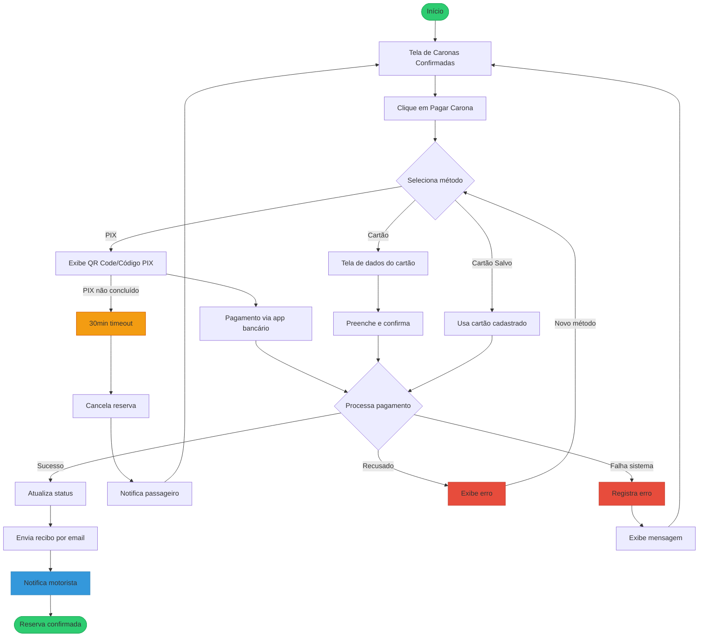
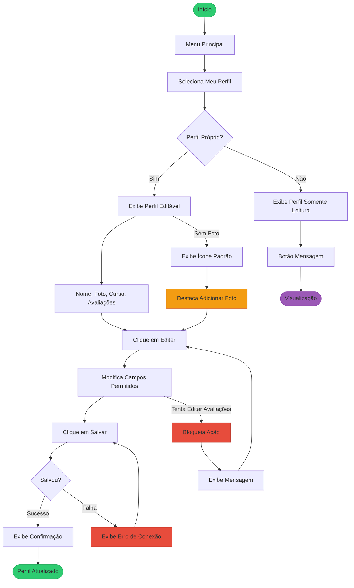

# Caso de Uso: UC001 

## Nome

Buscar Caronas Disponíveis

## Descrição

Este caso de uso permite que um passageiro busque caronas disponíveis com base em local de partida e destino, visualizando informações como nome do motorista, horário e vagas disponíveis.

## Atores

-Ator Primário: Passageiro
-Atores Secundários: Motorista (fornece as caronas disponíveis)

## Pré-condições

1. O usuário está autenticado no sistema.
2. Existem caronas cadastradas no sistema.

## Fluxo Básico

1. O passageiro acessa a tela principal e seleciona "Buscar Caronas".
* O sistema exibe um formulário com os campos:
  Local de Partida (obrigatório)

  Destino (obrigatório)

2. O passageiro preenche os campos e clica em "Buscar".
* O sistema retorna uma lista de caronas disponíveis, contendo:

  Nome do motorista
  
  Horário da carona
  
  Vagas disponíveis

3. O passageiro seleciona uma carona e clica em "Solicitar Vaga".
4. O sistema registra a solicitação e notifica o motorista.


## Fluxos Alternativos

### Alternativa 1
1. Filtros Adicionais
   
 1. No passo 2, o passageiro pode aplicar filtros adicionais (ex.: data, horário).

 2. O sistema atualiza a lista de caronas conforme os filtros selecionados.

### Alternativa 2

2. Nenhuma Carona Encontrada
   
 1. No passo 4, se não houver caronas disponíveis, o sistema exibe:

 2. "Nenhuma carona encontrada para o trajeto selecionado."

 3. O passageiro pode ajustar os critérios de busca e tentar novamente.
   
## Fluxos de Exceção

### Exceção 1

1. Campos Obrigatórios Não Preenchidos
No passo 3, se o passageiro não preencher os campos obrigatórios, o sistema exibe:

 "Preencha o local de partida e destino para buscar caronas."

O sistema impede a busca até que os campos sejam preenchidos.

### Exceção 2

2. Falha na Conexão
No passo 4, se houver falha na conexão, o sistema exibe:

 "Não foi possível buscar caronas. Verifique sua conexão e tente novamente."

## Pós-condições

1. O passageiro visualiza a lista de caronas disponíveis.
2. Se uma solicitação for enviada, o motorista é notificado.


## Requisitos Relacionados

- RF001: Buscar caronas por local de partida e destino.
- RF008: Motorista pode criar ofertas de carona.
- RNF002: Segurança na autenticação do usuário.

## Interface de Usuário

#### Tela de Busca:
Campos de texto para Local de Partida e Destino.

Botão "Buscar".

#### Lista de resultados com:
Foto e nome do motorista.

## Diagrama


# Caso de Uso: UC002 

## Nome

 Realizar Pagamento da Carona

## Descrição

Permite que o passageiro realize o pagamento de uma carona solicitada e aceita, utilizando PIX ou cartão de crédito/débito, gerando um comprovante digital.

## Atores

- Ator Primário: Passageiro
- Atores Secundários:
 Motorista (recebe confirmação do pagamento)
 Sistema de Pagamento (processa a transação)

## Pré-condições

1. O passageiro está autenticado no sistema.
2. O motorista aceitou a solicitação de carona.
3. O passageiro ainda não realizou o pagamento.

## Fluxo Básico

1. O sistema exibe a opção "Pagar Carona" na tela de caronas confirmadas.
2. O passageiro seleciona o método de pagamento (PIX ou Cartão).
- Para PIX:

   O sistema gera um QR Code ou código copia-e-cola.

   O passageiro realiza o pagamento via app bancário.

- Para Cartão:

  O sistema redireciona para tela de inserção de dados do cartão.

  O passageiro preenche os dados e confirma o pagamento.

3. O sistema processa o pagamento e:

  Envia confirmação ao motorista.

  Gera e envia recibo digital por e-mail ao passageiro.

  A vaga na carona é oficialmente reservada.


## Fluxos Alternativos

### Alternativa 1

1. Pagamento com Cartão Salvo
   
 - No passo 2, se o passageiro tiver cartão cadastrado:

    O sistema mostra opção "Usar Cartão Salvo".

    O pagamento é processado automaticamente após confirmação.

### Alternativa 2
1. Pagamento Pendente (PIX não concluído)
 - Se o passageiro não finalizar o PIX em 30 minutos:
2. O sistema cancela a reserva automaticamente.
3. Notifica o passageiro: "Pagamento não concluído. Tente novamente."


## Fluxos de Exceção

### Exceção 1: Pagamento Recusado

1. Se o pagamento for recusado (cartão negado/PIX falho):
2. O sistema exibe: "Pagamento não aprovado. Tente outro método."
3. Permite nova tentativa ou alteração de método.

### Exceção 2: Falha no Processamento

1. Se houver erro no sistema durante o pagamento:
2. O sistema registra a falha e exibe: "Erro ao processar. Tente mais tarde."
3. A carona permanece como "pendente de pagamento".

## Pós-condições

1. O motorista recebe confirmação da reserva paga.
2. O passageiro recebe recibo por e-mail.
3. A vaga é marcada como ocupada na carona.

## Requisitos Relacionados

- RF002: Pagamento via PIX ou cartão.
- RNF002: Segurança nas transações (dados criptografados).
- RF005: Motorista só confirma após pagamento.

## Interface de Usuário

#### Tela de Pagamento:

- Seletor de método (PIX/Cartão).
- QR Code ou campo para dados do cartão.
- Botão "Confirmar Pagamento".
- Mensagem de status (ex.: "Aguardando confirmação PIX").

#### E-mail de Recibo:

- Detalhes da carona (motorista, horário, valor).
- Código da transação.
- Horário e vagas disponíveis.
- Botão "Solicitar Vaga".

## Diagrama



# Caso de Uso: UC003

## Nome

Gerenciar Perfil do Usuário

## Descrição

Permite que o usuário (passageiro ou motorista) visualize, edite e mantenha seu perfil atualizado com informações pessoais, foto e histórico de caronas, garantindo transparência e confiabilidade no sistema.

## Atores
 
- Ator Primário: Usuário (Passageiro ou Motorista)
- Atores Secundários:

   Outros usuários (visualizam o perfil)

   Sistema de Avaliações (atualiza as médias)

## Pré-condições

1. O usuário está autenticado no sistema.
2. O perfil do usuário foi criado durante o cadastro.

## Fluxo Básico

1. O usuário acessa a seção "Meu Perfil" no menu principal.
- O sistema exibe as seguintes informações:

  - Nome completo
  - Foto (se cadastrada)
  - Curso/faculdade (opcional)
  - Média de avaliações (1-5 estrelas)
  - Histórico de caronas (como passageiro/motorista)

- Para editar:

  - O usuário clica em "Editar Perfil".

2. sistema permite modificar:

   - Foto (upload ou remoção)
   - Curso/faculdade

3. Outras informações pessoais (exceto avaliações)
4. O usuário confirma as alterações clicando em "Salvar".
5. O sistema atualiza o perfil e exibe mensagem: "Alterações salvas com sucesso!".

## Fluxos Alternativos

### Alternativa 1: Visualizar Perfil de Outro Usuário

1. O usuário clica no nome/perfil de outro participante (em uma carona ou chat).
- O sistema exibe:

 - Informações públicas (nome, foto, avaliações médias).
 - Botão "Enviar Mensagem" (se aplicável).
 - Não é possível editar o perfil de outros usuários.

### Alternativa 2: Usuário Não Possui Foto

1. Se o usuário não tiver foto cadastrada:

   - O sistema exibe um ícone padrão (silhueta).
   - Mostra a opção "Adicionar Foto" destacada.

## Fluxos de Exceção

### Exceção 1: Falha ao Salvar Alterações

1. Se houver erro de conexão ao salvar:

   - O sistema exibe: "Não foi possível atualizar. Verifique sua conexão."

- Mantém os dados anteriores.

###Exceção 2: Tentativa de Editar Avaliações

1. Se o usuário tentar modificar avaliações recebidas (via inspeção HTML/console):
    - O sistema bloqueia a ação e exibe: "Avaliações não podem ser alteradas."

## Pós-condições

1. As informações editadas são atualizadas no perfil.
2. Outros usuários visualizam as mudanças em interações futuras.
3. A média de avaliações permanece imutável pelo usuário.

## Requisitos Relacionados

- RF003: Perfil com nome, foto, curso e avaliações.
- RF006: Avaliações após caronas concluídas.
- RNF001: Autenticação segura para acesso ao perfil.
  
## Interface de Usuário

- Tela de Perfil Pessoal:

   - Foto (ou ícone) + botão "Alterar Foto".
   - Campos editáveis (nome, curso, etc.).
   - Seção de avaliações (somente leitura).
   - Botão "Salvar"/"Cancelar".

- Tela de Perfil de Terceiros:

   - Apenas visualização (sem opções de edição).
   - Botão "Enviar Mensagem" (se não bloqueado).

## Diagrama



# Caso de Uso: UC004 

## Nome

Cadastro e Verificação de Identidade

## Descrição

Permite que novos usuários (passageiros e motoristas) criem uma conta no sistema através de cadastro com e-mail e complete a verificação de identidade necessária para utilizar a plataforma.

## Atores

- Ator Primário: Novo Usuário
- Ator Secundário: Sistema de Autenticação

## Pré-condições

1. O usuário não possui conta cadastrada no sistema
2. O dispositivo possui conexão com internet

## Fluxo Básico


1. O usuário acessa a opção "Criar Conta" na tela inicial
2. O sistema exibe formulário de cadastro solicitando:

    - Nome completo
    - E-mail válido
    - Senha (mínimo 8 caracteres)
    - Confirmação de senha

3. O usuário preenche todos os campos obrigatórios
4. O sistema valida os dados e envia e-mail de verificação
5. O usuário acessa seu e-mail e clica no link de verificação
6. O sistema confirma a verificação e redireciona para completar perfil

## Fluxos Alternativos

### Alternativa 1: Cadastro como Motorista

1. No passo 6, o usuário seleciona "Quero ser Motorista"
2. O sistema solicita documentos adicionais (CNH e documento com foto)
3. O usuário faz upload dos documentos
4. O sistema envia para verificação manual
5. Após aprovação (em até 48h), perfil de motorista é liberado

## Fluxos de Exceção

### Exceção 1: E-mail já cadastrado

1. No passo 4, se e-mail já existir no sistema:
2. Exibe mensagem: "Este e-mail já está em uso. Recuperar senha?"
3. Oferece opções: "Tentar outro e-mail" ou "Recuperar acesso"

### Exceção 2: Link de verificação expirado

1. Se usuário tentar verificar após 24h:
2. Sistema exibe: "Link expirado. Reenviar verificação?"
3. Ao confirmar, enga novo e-mail de verificação

## Pós-condições

1. Nova conta é criada no sistema (status "não verificado")
2. Após verificação, conta muda para status "ativo"
3. Usuário pode acessar todas funcionalidades básicas

## Requisitos Relacionados

- RF004: Cadastro com e-mail e verificação
- RNF002: Segurança na autenticação
- RF008: Diferenciação passageiro/motorista

## Interface de Usuário

##### Tela de Cadastro:
Campos: Nome, E-mail, Senha (com indicador de força)
- Checkbox "Concordo com Termos de Uso"
- Botão "Criar Conta"

E-mail de Verificação:
- Assunto: "Confirme seu e-mail para [NomeApp]"
- Corpo com botão "Verificar Agora" (link válido por 24h)

Tela de Documentos (Motorista):
- Área de upload para CNH e RG/CPF
- Preview dos documentos enviados
- Status "Em Análise" após envio

Regras de Negócio:
- Senha deve conter: 8+ caracteres, 1 número e 1 caractere especial
- Contas não verificadas em 7 dias são excluídas automaticamente
- Motoristas precisam ter CNH válida e documento com foto legível

## Diagrama


Caso de Uso: 
3. Atores


4. Pré-condições

5. Fluxo Básico


6. Fluxos Alternativos


7. Fluxos de Exceção


8. Pós-condições


9. Requisitos Relacionados


10. Interface de Usuário


> # Caso de Uso: Aceitar ou Recusar Solicitações de Carona
1. Nome do Caso de Uso
UC005 - Gerenciar Solicitações de Carona

2. Descrição
Permite que motoristas visualizem e respondam às solicitações de passageiros para suas caronas oferecidas, podendo aceitar ou recusar cada pedido individualmente.

3. Atores
Ator Primário: Motorista

Atores Secundários:

Passageiro (solicitante)

Sistema de Notificações

4. Pré-condições
O usuário está autenticado como motorista

Existe pelo menos uma carona criada pelo motorista

Há solicitações pendentes para essa carona

5. Fluxo Básico
O motorista acessa a seção "Minhas Caronas"

Seleciona a carona específica com solicitações pendentes

O sistema exibe a lista de solicitantes com:

Nome e foto do passageiro

Curso/faculdade (se disponível)

Avaliação média (estrelas)

Para cada solicitação, o motorista pode:

Clicar em "Aceitar" para confirmar a vaga

Clicar em "Recusar" para negar a solicitação

O sistema atualiza o status e notifica o passageiro

6. Fluxos Alternativos
Alternativa 1: Visualizar Perfil Completo do Passageiro
No passo 3, o motorista clica no nome do passageiro

O sistema exibe perfil completo com:

Histórico de caronas anteriores

Comentários de avaliações

Informações de contato (se permitido)

Alternativa 2: Vagas Esgotadas
Se todas as vagas já estiverem preenchidas:

O sistema desabilita novos "Aceitar"

Exibe: "Todas as vagas já foram preenchidas"

7. Fluxos de Exceção
Exceção 1: Solicitação Já Respondida
Se outro dispositivo já tiver respondido:

Exibe: "Esta solicitação já foi processada"

Atualiza a lista em tempo real

Exceção 2: Conexão Perdida
Se a conexão falhar durante o processo:

Mantém ações locais e sincroniza quando reconectar

Exibe: "Conectando... suas ações serão salvas"

8. Pós-condições
Para aceites:

Passageiro recebe confirmação

Vaga é reservada oficialmente

Sistema inicia processo de pagamento

Para recusas:

Passageiro recebe notificação

Solicitação é arquivada

9. Requisitos Relacionados
RF005: Motorista gerencia solicitações

RF001: Passageiro busca caronas

RF002: Pagamento após aceite

10. Interface de Usuário
Tela de Solicitações:

Lista com cards de cada passageiro

Botões "Aceitar" (verde) e "Recusar" (vermelho)

Contador "Vagas: 2/4"

Notificação para Passageiro:

Push notification: "Sua solicitação foi [aceita/recusada] por [Motorista]"

Regras de Negócio:

Motorista tem 24h para responder antes da solicitação expirar

Passageiros recusados podem solicitar outras caronas

Aceite gera obrigação de pagamento pelo passageiro


> # Caso de Uso: Avaliar Outro Usuário após Carona
1. Nome do Caso de Uso
UC006 - Avaliar Participante da Carona

2. Descrição
Permite que usuários (passageiros e motoristas) avaliem uns aos outros após a conclusão de uma carona, atribuindo notas de 1 a 5 estrelas e comentários opcionais, contribuindo para a reputação no sistema.

3. Atores
Ator Primário: Usuário (Passageiro ou Motorista)

Ator Secundário: Sistema de Reputação

4. Pré-condições
A carona foi concluída (status "Finalizada")

O usuário ainda não avaliou o outro participante

O usuário está autenticado no sistema

5. Fluxo Básico
Após 1 hora da finalização da carona, o sistema envia notificação:
"Avalie sua experiência com [Nome do Participante]"

O usuário acessa a seção "Histórico de Caronas"

Seleciona a carona concluída e clica em "Avaliar"

O sistema exibe formulário com:

Seletor de 1-5 estrelas (obrigatório)

Campo de texto para comentário (opcional, até 200 caracteres)

O usuário preenche a avaliação e clica em "Enviar"

O sistema:

Atualiza a média do participante avaliado

Armazena a avaliação no histórico

Notifica o avaliado sobre a nova avaliação

6. Fluxos Alternativos
Alternativa 1: Avaliação Anônima
Para avaliações negativas (≤ 2 estrelas):

O sistema oferece opção "Enviar anonimamente"

Comentários não identificam o avaliador

Alternativa 2: Edição de Avaliação
Se o usuário enviar por engano:

Permite editar dentro de 2 horas após envio

Após este período, avaliação torna-se permanente

7. Fluxos de Exceção
Exceção 1: Tentativa de Avaliação Antecipada
Se tentar avaliar antes da carona terminar:

Sistema bloqueia com mensagem:
"Avalie apenas após o término da carona"

Exceção 2: Conexão Interrompida
Se falhar durante o envio:

Salva rascunho localmente

Exibe: "Avaliação não enviada. Tentar novamente?"

8. Pós-condições
A avaliação é vinculada permanentemente ao perfil do avaliado

A média de estrelas é recalculada automaticamente

O avaliador não pode reavaliar o mesmo usuário para aquela carona

9. Requisitos Relacionados
RF006: Avaliação pós-carona

RF003: Exibição no perfil

RNF003: Notificações em tempo real

10. Interface de Usuário
Tela de Avaliação:
[Ícone de estrelas (1-5 interativas)]  
[Campo de texto: "Compartilhe sua experiência (opcional)"]  
[Contador: "200 caracteres restantes"]  
[Checkbox: "Enviar anonimamente" (se ≤2 estrelas)]  
[Botão "Enviar Avaliação"]  
Notificação para o Avaliado:
"Você recebeu uma nova avaliação de [X estrelas]!"  
[Visualizar comentário]  
Regras de Negócio:

Período de avaliação: até 7 dias após a carona

Média calculada com peso temporal (avaliações recentes têm maior impacto)

Comentários ofensivos são filtrados automaticamente

> # # **Caso de Uso: Cancelar Carona (Motorista)**

## **1. Nome do Caso de Uso**  
**UC007 - Cancelar Carona por Motorista**

## **2. Descrição**  
Permite que motoristas cancelem caronas previamente agendadas, desde que realizado dentro do prazo estabelecido (até 2 horas antes do horário marcado), com notificação automática a todos os passageiros afetados.

## **3. Atores**  
- **Ator Primário:** Motorista  
- **Atores Secundários:**  
  - Passageiros (notificados sobre o cancelamento)  
  - Sistema de Reembolsos (se aplicável)  

## **4. Pré-condições**  
1. O motorista está autenticado no sistema  
2. Existe pelo menos uma carona agendada criada pelo motorista  
3. O horário atual é pelo menos 2 horas antes do horário marcado da carona  

## **5. Fluxo Básico**  
1. O motorista acessa a seção "Minhas Caronas"  
2. Seleciona a carona que deseja cancelar  
3. O sistema exibe o botão "Cancelar Carona"  
4. O motorista clica no botão e confirma a ação  
5. O sistema:  
   - Remove a carona do sistema  
   - Envia notificação automática a todos os passageiros  
   - Inicia processo de reembolso (se pagamento foi realizado)  
6. O motorista recebe confirmação do cancelamento  

## **6. Fluxos Alternativos**  

### **Alternativa 1: Cancelamento com Reembolso**  
1. Se passageiros já pagaram:  
   - Sistema processa reembolso automático  
   - Envia e-mail com comprovante de reembolso  

### **Alternativa 2: Sugerir Nova Carona**  
1. O sistema pode sugerir:  
   - "Deseja reagendar esta carona?"  
   - Se sim, redireciona para tela de edição  

## **7. Fluxos de Exceção**  

### **Exceção 1: Tentativa de Cancelamento Tardio**  
1. Se motorista tentar cancelar com menos de 2 horas:  
   - Sistema exibe:  
   *"Cancelamento não permitido. Contate os passageiros diretamente."*  

### **Exceção 2: Falha na Notificação**  
1. Se algum passageiro não receber notificação:  
   - Sistema mantém registro e reenvia a cada 15 minutos  
   - Exibe para motorista:  
   *"Alguns passageiros ainda não foram notificados"*  

## **8. Pós-condições**  
1. A carona é removida do sistema  
2. Todos os passageiros são notificados  
3. Status é atualizado no histórico do motorista  
4. Reembolsos são processados quando aplicável  

## **9. Requisitos Relacionados**  
- **RF007:** Cancelamento por motorista  
- **RF002:** Processo de reembolso  
- **RNF003:** Notificações em tempo real  

## **10. Interface de Usuário**  

### **Tela de Cancelamento:**  
```
[Título: "Cancelar Carona para [Destino]?"]  
[Mensagem: "Esta ação notificará todos os passageiros"]  
[Botão "Confirmar Cancelamento" (vermelho)]  
[Botão "Voltar" (cinza)]  
```

### **Notificação para Passageiros:**  
```
"ATENÇÃO: Carona para [Destino] foi cancelada"  
"Motivo: [Opções pré-definidas]"  
"Valor será reembolsado em até 5 dias úteis" (se aplicável)  
```

**Regras de Negócio:**  
1. Janela de cancelamento: até 2 horas antes da carona  
2. Limite de cancelamentos: máximo 3 por mês para evitar abusos  
3. Passageiros frequentes em caronas canceladas recebem créditos de compensação  

Este caso de uso garante um processo justo e transparente para cancelamentos, protegendo tanto motoristas quanto passageiros.

> # # **Caso de Uso: Criar Oferta de Carona**

## **1. Nome do Caso de Uso**  
**UC008 - Criar Oferta de Carona**

## **2. Descrição**  
Permite que motoristas cadastrados criem ofertas de caronas compartilhadas, informando trajeto, horários e número de vagas disponíveis para outros universitários.

## **3. Atores**  
- **Ator Primário:** Motorista (verificado)  
- **Ator Secundário:** Sistema de Georreferenciamento  

## **4. Pré-condições**  
1. Usuário autenticado possui perfil de motorista verificado  
2. Possui veículo cadastrado no sistema (opcional)  
3. Conexão com internet ativa  

## **5. Fluxo Básico**  
1. Motorista acessa a opção "Oferecer Carona"  
2. Sistema exibe formulário com campos:
   - Local de partida (com autocompletar)  
   - Destino (com autocompletar)  
   - Data e horário de saída  
   - Número de vagas disponíveis (1-4)  
   - Valor sugerido por passageiro (opcional)  
   - Observações (ex: "Levo mochila pequena")  
3. Motorista preenche os campos obrigatórios  
4. Sistema valida os dados e exibe pré-visualização  
5. Motorista confirma a publicação  
6. Sistema:
   - Disponibiliza a carona para busca  
   - Atualiza o status para "Disponível"  

## **6. Fluxos Alternativos**  

### **Alternativa 1: Carona Recorrente**  
1. No passo 2, motorista seleciona "Viagem recorrente"  
2. Sistema adiciona campos:
   - Dias da semana (ex: seg/qua/sex)  
   - Período de vigência (data final)  

### **Alternativa 2: Usar Localização Atual**  
1. Motorista clica em "Usar minha localização atual"  
2. Sistema preenche automaticamente o local de partida  

## **7. Fluxos de Exceção**  

### **Exceção 1: Perfil Não Verificado**  
1. Se usuário tentar criar oferta sem ser motorista:
   - Sistema exibe:  
   *"Complete sua verificação como motorista primeiro"*  
   - Redireciona para tela de cadastro de motorista  

### **Exceção 2: Horário Inválido**  
1. Se selecionar horário passado:
   - Sistema alerta:  
   *"Selecione um horário futuro"*  
   - Bloqueia a publicação  

## **8. Pós-condições**  
1. Nova carona aparece nos resultados de busca  
2. Motorista recebe notificação quando há solicitações  
3. Carona é arquivada automaticamente após o horário  

## **9. Requisitos Relacionados**  
- **RF008:** Criação de ofertas por motoristas  
- **RF001:** Integração com busca de caronas  
- **RNF004:** Validação de localização  

## **10. Interface de Usuário**  

### **Formulário de Criação:**  
```
[Mapa interativo com arrastar/soltar para ajustar pontos]  
[Seletor de data/horário (datetime picker)]  
[Slider para número de vagas (1-4)]  
[Campo "Valor sugerido" com máscara monetária]  
[Área "Observações" (textarea)]  
[Botão "Visualizar Antes de Publicar"]  
```

### **Pré-visualização:**  
```
"Você está oferecendo:  
De [Origem] para [Destino]  
Dia [data] às [hora]  
[Vagas] vaga(s) disponível(eis)"  
[Botão "Publicar Agora"]  
```

**Regras de Negócio:**  
1. Limite de caronas ativas: 5 por motorista  
2. Período mínimo para publicação: 1 hora antes do horário  
3. Caronas com mesmo trajeto são agrupadas automaticamente  

Este caso de uso otimiza a criação de caronas com ferramentas intuitivas, garantindo que apenas motoristas verificados possam oferecer viagens seguras para a comunidade universitária.
