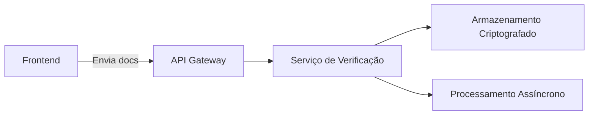

# História de Usuário: UC004

## Título
Sistema de Verificação de Identidade

## Narrativa
**Como** administrador do sistema  
**Eu quero** verificar a identidade de motoristas e passageiros  
**Para que** possamos garantir a segurança e confiabilidade da plataforma

## Critérios de Aceitação
1. [x] Fluxo de verificação básica (todos usuários):
   - Confirmação de e-mail institucional (.edu.br)
   - Validação de número de celular (SMS)
   - Documento de identidade (frente/verso)

2. [x] Verificação avançada (motoristas):
   - CNH válida (foto + autenticação Detran)
   - Selfie com documento
   - Verificação facial (Liveness Detection)

3. [x] Estados de verificação:
   - Pendente (até 48h para análise)
   - Aprovado
   - Rejeitado (com motivo)
   - Expirado (renovação anual)

4. [x] Notificações:
   - Alertas de status via e-mail/push
   - Lembretes para documentos próximos a expirar

## Detalhes Técnicos
**Arquitetura:**


**Stack Tecnológica:**
- **Frontend:**
  - Componente de upload com preview
  - Biblioteca de câmera (react-webcam)
  - Máscaras para documentos (react-input-mask)

- **Backend:**
  ```python
  # Exemplo de endpoint
  @post('/api/verify')
  def verify_identity():
      validate_documents()
      check_against_government_api()
      trigger_manual_review_if_needed()
  ```

- **Segurança:**
  - Criptografia AES-256 em repouso
  - RBAC (Controle de Acesso Baseado em Função)
  - Auditoria de acesso completa

## Dependências
1. RF001 - Cadastro de usuário
2. RNF004 - Armazenamento seguro de documentos
3. RF009 - Sistema de notificações

## Estimativa
**Story Points:** 13 (Complexidade Alta)  
**Timeline:** 
- Fase 1 (Básica): 2 sprints 
- Fase 2 (Motoristas): 3 sprints

## Prioridade
**MoSCoW:** Must  
**Justificativa:** Requisito legal e de segurança

## Observações
1. Conformidade com:
   - LGPD (Lei Geral de Proteção de Dados)
   - Normativas do Denatran
2. Processos manuais para:
   - Documentos estrangeiros
   - Casos especiais
3. Rotina automática de:
   - Exclusão de documentos após 90 dias
   - Renovação anual obrigatória
