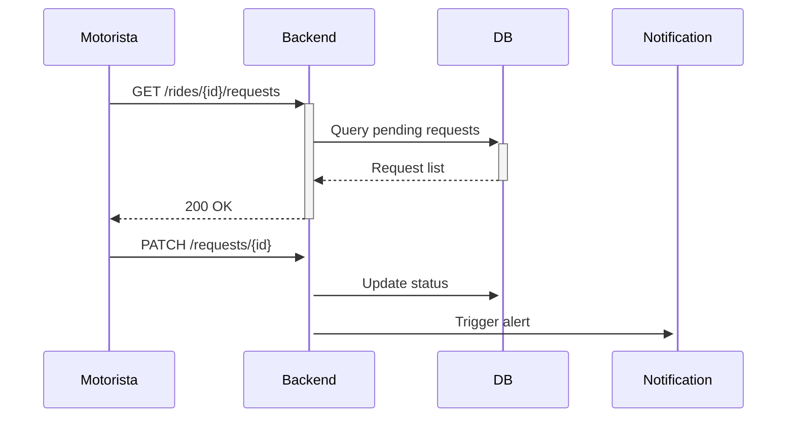

# História de Usuário: UC006

## Título
Gestão de Solicitações de Carona

## Narrativa
**Como** motorista  
**Eu quero** gerenciar solicitações de passageiros  
**Para que** eu possa controlar quem viajará comigo

## Critérios de Aceitação

### Fluxo Principal
1. [x] Listagem de solicitações:
   - Exibir foto, nome e avaliação média do passageiro
   - Mostrar status "Pendente" com timestamp
   - Ordenar por: 1) Avaliação 2) Proximidade

2. [x] Ações disponíveis:
   - Aceitar (altera status e reserva vaga)
   - Recusar (opção de motivo pré-definido)
   - Ver perfil completo

3. [x] Notificações:
   - Passageiro recebe confirmação imediata
   - Atualização em tempo real para outros solicitantes

### Validações
4. [x] Restrições:
   - Tempo máximo para resposta: 24h
   - Limite de 3 recusas consecutivas
   - Bloqueio após aceite confirmado

## Detalhes Técnicos

### Arquitetura


### Componentes Frontend
```vue
<RequestCard 
  v-for="request in pendingRequests"
  :key="request.id"
  :user="request.passenger"
  @accept="handleAccept"
  @reject="handleReject"
/>
```

### Endpoints Backend
| Método | Endpoint | Descrição |
|--------|----------|-----------|
| GET | `/rides/{id}/requests` | Lista solicitações |
| PATCH | `/requests/{id}` | Atualiza status |
| POST | `/notifications` | Envia confirmação |

## Dependências
1. **RF003**: Perfil de usuário
2. **RF005**: Sistema de notificações
3. **RNF002**: Banco de dados em tempo real

## Estimativa
**Story Points:** 5  
**Sprints:** 1 (2 semanas)

## Prioridade
**MoSCoW:** Must  
**Impacto:** Alta (engajamento de usuários)

## Observações
1. Otimizações:
   - Paginação para >10 solicitações
   - Cache de perfis (15min)
2. Segurança:
   - Verificação de ownership
   - Rate limiting (10 ações/minuto)
3. Fallback:
   - Estado offline persistente
   - Sincronização quando reconectar
