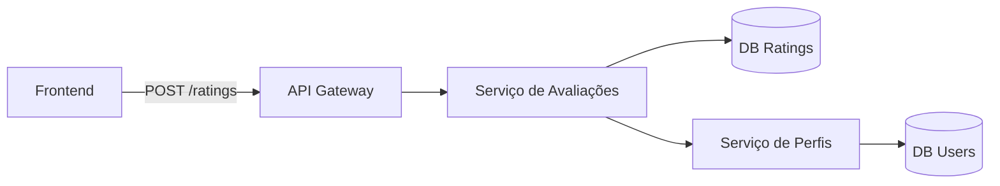

# História de Usuário: UC007

## Título
Sistema de Avaliação Pós-Carona

## Narrativa
**Como** usuário do sistema  
**Eu quero** avaliar meus companheiros de viagem  
**Para que** a comunidade possa manter padrões de confiabilidade

## Critérios de Aceitação

### Fluxo de Avaliação
1. [x] Gatilho de avaliação:
   - Disponível 1h após conclusão da carona
   - Prazo máximo: 7 dias
   - Notificação push + e-mail de lembrete

2. [x] Componentes de avaliação:
   - Seletor de 1-5 estrelas (obrigatório)
   - Campo de comentário (opcional, 200 caracteres)
   - Opção de anonimato para avaliações ≤ 2 estrelas

3. [x] Impacto no sistema:
   - Cálculo automático da média (ponderada por recência)
   - Exibição no perfil do usuário
   - Atualização em tempo real

### Regras de Negócio
4. [x] Restrições:
   - Uma avaliação por carona
   - Edição permitida por 2h após envio
   - Filtro de linguagem inapropriada

## Detalhes Técnicos

### Arquitetura


### Componente React
```jsx
<RatingModal>
  <StarRating 
    count={5} 
    onChange={setRating}
  />
  <TextArea 
    maxLength={200} 
    placeholder="Descreva sua experiência..."
  />
  <AnonymousToggle 
    show={rating <= 2} 
  />
</RatingModal>
```

### Modelo de Dados
```typescript
interface Rating {
  id: string;
  rideId: string;
  raterId: string;
  targetId: string;
  value: 1 | 2 | 3 | 4 | 5;
  comment?: string;
  isAnonymous: boolean;
  createdAt: Date;
}
```

## Dependências
1. **RF003**: Perfil de usuário
2. **RF012**: Sistema de notificações
3. **RNF006**: Moderação de conteúdo

## Estimativa
**Story Points:** 3  
**Tempo de Desenvolvimento:** 
- Backend: 2 dias
- Frontend: 3 dias
- Testes: 1 dia

## Prioridade
**MoSCoW:** Should  
**Justificativa:** Melhoria de qualidade mas não bloqueante

## Observações
1. Considerar:
   - Efeito de avaliações extremas na média
   - Proteção contra fake reviews
   - GDPR - Direito ao esquecimento
2. Otimizações:
   - Cache de avaliações (TTL 1h)
   - Pré-cálculo de médias
